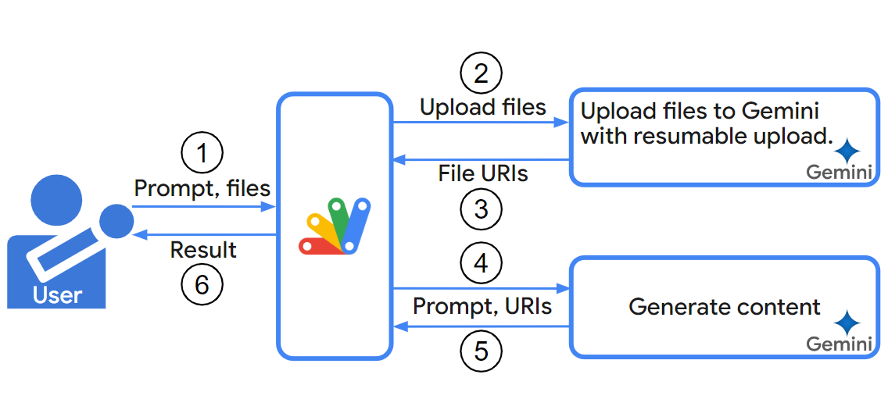

# UploadApp

<a name="top"></a>
[](LICENCE)

<a name="overview"></a>



# Overview

This is a Google Apps Script for uploading a file to Gemini, Google Drive, YouTube, and so on with the resumable upload.

# Description

This report explores the limitations of data upload size using Google Apps Script and introduces a script to overcome these limitations. In the current stage, Gemini API can generate content using the uploaded data to Gemini. You can find more information on this in a previous report. [Ref](https://medium.com/google-cloud/generating-texts-using-files-uploaded-by-gemini-1-5-api-5777f1c902ab) As mentioned in the report, Google Apps Script uses `uploadType=multipart` for uploading files. However, the maximum file size is limited to 5 MB with this method for Drive API. [Ref](https://developers.google.com/drive/api/guides/manage-uploads) While I confirmed that the Gemini API allows for uploading over about 20 MB with `uploadType=multipart`, Google Apps Script enforces a stricter 50 MB limit for both uploads and downloads. [Ref](https://developers.google.com/apps-script/guides/services/quotas#current_limitations) This can be inconvenient when working with larger datasets, such as movie or text data, which often exceed this limit.

To address this limitation, I have created a script that leverages `uploadType=resumable` to upload files larger than 50 MB by freely changing the destination endpoint. This script not only enables uploading large files to Gemini but also supports uploading data from Google Drive and external URLs to other services like Google Drive and YouTube.

# Usage

## 1. Prepare a Google Apps Script project

Please create a Google Apps Script project. In this case, you can use both the standalone type and the container-bound type.

Please open the script editor.

## 2. Enable Drive API

Please enable Drive API at Advanced Google services. [Ref](https://developers.google.com/apps-script/guides/services/advanced#enable_advanced_services)

## 3. Class UploadApp

Please copy and paste the following script to the script editor.

```javascript
/**
 * ### Description
 * Upload a little large data with Google APIs. The target of this script is the data with several hundred MB.
 * GitHub: https://github.com/tanaikech/UploadApp
 *
 * Sample situation:
 * - Upload a file from Google Drive to Gemini, Google Drive, YouTube, and so on.
 * - Upload a file from the URL outside of Google to Gemini, Google Drive, YouTube, and so on.
 */
class UploadApp {
  /**
   *
   * @param {Object} object Information of the source data and the metadata of the destination.
   * @param {Object} object.source Information of the source data.
   * @param {Object} object.destination Information of the metadata of the destination.
   */
  constructor(object = {}) {
    this.property = PropertiesService.getScriptProperties();
    const next = this.property.getProperty("next");
    if (
      !next &&
      (!object.source || (!object.source.fileId && !object.source.url))
    ) {
      throw new Error("Please set a valid object.");
    } else if (next) {
      this.tempObject = JSON.parse(next);
      this.current = this.tempObject.next;
      this.tempObject.next = 0;
      if (this.tempObject.result) {
        delete this.tempObject.result;
      }
    } else {
      this.current = 0;
      this.tempObject = { orgObject: { ...object } };
    }
    if (this.tempObject.orgObject.source.fileId) {
      this.googleDrive = true;
      this.fileGet = `https://www.googleapis.com/drive/v3/files/${this.tempObject.orgObject.source.fileId}?supportsAllDrives=true`;
      this.downloadUrl = `${this.fileGet}&alt=media`;
    } else {
      this.googleDrive = false;
      this.downloadUrl = this.tempObject.orgObject.source.url;
    }
    this.startTime = Date.now();
    this.limitProcessTime = 300 * 1000; // seconds
    this.authorization = `Bearer ${
      this.tempObject.orgObject.accessToken || ScriptApp.getOAuthToken()
    }`;
    this.chunkSize = 16777216; // Chunk size is 16 MB.
  }

  /**
   * ### Description
   * Main method.
   *
   * @returns {Object} Response value. When the file could be completly uploaded, the file metadata of the uploaded file is returned. When the file is not be completly uploaded, an object including message.
   */
  run() {
    if (this.current == 0) {
      console.log("Get metadata");
      this.getMetadata_();
      console.log("Calculate chunks");
      this.getChunks_();
      console.log("Get location");
      this.getLocation_();
    }
    console.log("Download and upload data.");
    this.downloadAndUpload_();
    return this.tempObject.result;
  }

  /**
   * ### Description
   * Get metadata of the source data.
   *
   * @return {void}
   * @private
   */
  getMetadata_() {
    if (this.googleDrive) {
      const res = UrlFetchApp.fetch(`${this.fileGet}&fields=mimeType%2Csize`, {
        headers: { authorization: this.authorization },
      });
      const obj = JSON.parse(res.getContentText());
      if (obj.mimeType.includes("application/vnd.google-apps")) {
        throw new Error(
          "This script cannot be used to the files related to Google. For example, Google Doc, Google Sheet, and so on."
        );
      }
      this.tempObject.orgObject.source.mimeType = obj.mimeType;
      this.tempObject.orgObject.source.size = obj.size;
      return;
    }
    const res = UrlFetchApp.fetch(this.downloadUrl, {
      muteHttpExceptions: true,
      headers: { Range: "bytes=0-1" },
    });
    if (res.getResponseCode() != 206) {
      throw new Error("This file cannot be done the resumable download.");
    }
    const headers = res.getHeaders();
    const range = headers["Content-Range"].split("/");
    this.tempObject.orgObject.source.fileName =
      headers["Content-Disposition"] &&
      headers["Content-Disposition"].match(/filename=\"([a-zA-Z0-9\s\S].+)\";/)
        ? headers["Content-Disposition"]
            .match(/filename=\"([a-zA-Z0-9\s\S].+)\";/)[1]
            .trim()
        : this.startTime.toString();
    this.tempObject.orgObject.source.mimeType =
      headers["Content-Type"].split(";")[0];
    this.tempObject.orgObject.source.size = Number(range[1]);
  }

  /**
   * ### Description
   * Calculate the chunks for uploading.
   *
   * @return {void}
   * @private
   */
  getChunks_() {
    const chunks = [
      ...Array(
        Math.ceil(this.tempObject.orgObject.source.size / this.chunkSize)
      ),
    ].map((_, i, a) => [
      i * this.chunkSize,
      i == a.length - 1
        ? this.tempObject.orgObject.source.size - 1
        : (i + 1) * this.chunkSize - 1,
    ]);
    this.tempObject.chunks = chunks;
  }

  /**
   * ### Description
   * Get location URL for uploading.
   *
   * @return {void}
   * @private
   */
  getLocation_() {
    const options = {
      payload: JSON.stringify(this.tempObject.orgObject.destination.metadata),
      contentType: "application/json",
      muteHttpExceptions: true,
    };
    const q = this.parseQueryParameters_(
      this.tempObject.orgObject.destination.uploadUrl
    );
    if (!q.queryParameters.uploadType) {
      throw new Error(
        "Please confirm whether your endpoint can be used for the resumable upload. And, please include uploadType=resumable in uploadUrl."
      );
    }
    if (!q.queryParameters.key) {
      options.headers = { authorization: this.authorization };
    }
    const res = UrlFetchApp.fetch(
      this.tempObject.orgObject.destination.uploadUrl,
      options
    );
    if (res.getResponseCode() != 200) {
      throw new Error(res.getContentText());
    }
    this.tempObject.location = res.getAllHeaders()["Location"];
  }

  /**
   * ### Description
   * Download and upload data.
   *
   * @return {void}
   * @private
   */
  downloadAndUpload_() {
    let res1 = [];
    const len = this.tempObject.chunks.length;
    for (let i = this.current; i < len; i++) {
      const e = this.tempObject.chunks[i];
      const currentBytes = `${e[0]}-${e[1]}`;
      console.log(`Now... ${i + 1}/${len}`);
      const params1 = {
        headers: { range: `bytes=${currentBytes}` },
        muteHttpExceptions: true,
      };
      if (this.googleDrive) {
        params1.headers.authorization = this.authorization;
      }
      console.log(`Start downloading data with ${currentBytes}`);
      res1 = UrlFetchApp.fetch(this.downloadUrl, params1).getContent();
      console.log(`Finished downloading data with ${currentBytes}`);
      const params2 = {
        headers: {
          "Content-Range": `bytes ${currentBytes}/${this.tempObject.orgObject.source.size}`,
        },
        payload: res1,
        muteHttpExceptions: true,
      };
      console.log(`Start uploading data with ${currentBytes}`);
      const res2 = UrlFetchApp.fetch(this.tempObject.location, params2);
      console.log(`Finished uploading data with ${currentBytes}`);
      const statusCode = res2.getResponseCode();
      if (statusCode == 200) {
        console.log("Done.");
        this.tempObject.result = JSON.parse(res2.getContentText());
      } else if (statusCode == 308) {
        console.log("Upload the next chunk.");
        res1.splice(0, res1.length);
      } else {
        throw new Error(res2.getContentText());
      }
      if (Date.now() - this.startTime > this.limitProcessTime) {
        this.tempObject.next = i + 1;
        this.property.setProperty("next", JSON.stringify(this.tempObject));
        break;
      }
    }
    if (this.tempObject.next > 0 && !this.tempObject.result) {
      const message =
        "There is the next upload chunk. So, please run the script again.";
      console.warn(message);
      this.tempObject.result = { message };
    } else {
      this.property.deleteProperty("next");
    }
  }

  /**
   * ### Description
   * Parse query parameters.
   * ref: https://github.com/tanaikech/UtlApp?tab=readme-ov-file#parsequeryparameters
   *
   * @param {String} url URL including the query parameters.
   * @return {Array} Array including the parsed query parameters.
   * @private
   */
  parseQueryParameters_(url) {
    if (url === null || typeof url != "string") {
      throw new Error(
        "Please give URL (String) including the query parameters."
      );
    }
    const s = url.split("?");
    if (s.length == 1) {
      return { url: s[0], queryParameters: null };
    }
    const [baseUrl, query] = s;
    if (query) {
      const queryParameters = query.split("&").reduce(function (o, e) {
        const temp = e.split("=");
        const key = temp[0].trim();
        let value = temp[1].trim();
        value = isNaN(value) ? value : Number(value);
        if (o[key]) {
          o[key].push(value);
        } else {
          o[key] = [value];
        }
        return o;
      }, {});
      return { url: baseUrl, queryParameters };
    }
    return null;
  }
}
```

## 4. Upload a file to Gemini

Please copy and paste the following script to the script editor. Please get the API key using Gemini API and set your API key and the file ID of the file you want to upload.

```javascript
function sample1() {
  const apiKey = "###"; // Please set your API key.
  const fileId = "###"; // Please set the file ID of the uploaded file on Google Drive.

  const object = {
    source: { fileId },
    destination: {
      uploadUrl: `https://generativelanguage.googleapis.com/upload/v1beta/files?uploadType=resumable&key=${apiKey}`,
      metadata: {
        file: { displayName: DriveApp.getFileById(fileId).getName() },
      },
    },
    accessToken: ScriptApp.getOAuthToken(),
  };
  const res = new UploadApp(object).run();
  console.log(res);

  // DriveApp.createFile(); // This comment line is used for automatically detecting a scope of Drive API. So, please don't remove this.
}
```

When this script is run, the file is uploaded with the resumable upload. In my test, a file of 200 MB in size could be uploaded by one execution of the script. Namely, it was finished within 6 minutes. And, the following result is returned. This value can be used for generating content with Gemini API.

```json
{
  "file": {
    "name": "files/###",
    "displayName": "sample name",
    "mimeType": "video/mp4",
    "sizeBytes": "123456789",
    "createTime": "2024-07-10T00:00:00.000000Z",
    "updateTime": "2024-07-10T00:00:00.000000Z",
    "expirationTime": "2024-07-12T00:00:00.000000Z",
    "sha256Hash": "###",
    "uri": "https://generativelanguage.googleapis.com/v1beta/files/###",
    "state": "ACTIVE"
  }
}
```

As another piece of information, if you want to download the data from a URL and upload it to Gemini, please replace `url` instead of `fileId` in the property `source` as follows. But, in this case, it is required to be able to download partially the data from the URL. Please be careful about this.

```
source: { url: "###" },
```

`uploadUrl` and `metadata` in `destination` are the endpoint for uploading data and the metadata of the uploading data, respectively. About the details of them, please check the official document of the API you want to use. For example, you can see the official document of "Method: media.upload" of Gemini API at [here](https://ai.google.dev/api/rest/v1beta/media/upload).

As another sample script, when the following steps are reflected in a script, it becomes as follows.

1. Upload video file to Gemini.
2. Generate content with Gemini.

In this case, please install my Google Apps Script library [GeminiWithFiles](https://github.com/tanaikech/GeminiWithFiles).

```javascript
function sample1b() {
  const apiKey = "###"; // Please set your API key.
  const fileId = "###"; // File ID of the sample video (mp4) on your Google Drive.

  const q = "Description this video."; // Prompt

  // Upload mp4 data to Gemini.
  const object = {
    source: { fileId },
    destination: {
      uploadUrl: `https://generativelanguage.googleapis.com/upload/v1beta/files?uploadType=resumable&key=${apiKey}`,
      metadata: {
        file: { displayName: DriveApp.getFileById(fileId).getName() },
      },
    },
    accessToken: ScriptApp.getOAuthToken(),
  };
  const { file } = new UploadApp(object).run();

  // Generate content with the uploaded mp4 data.
  const g = GeminiWithFiles.geminiWithFiles({ apiKey, functions: {} });
  const res = g
    .withUploadedFilesByGenerateContent([file])
    .generateContent({ q });
  console.log(res);
}
```

## 5. Another sample scripts

At Class UploadApp, the file can be simply uploaded to another endpoint by changing `uploadUrl` and `metadata` of `destination`. As with other sample scripts, here, I would like to introduce uploading a file to Google Drive and YouTube.

### Upload a file to Google Drive

```javascript
function sample2() {
  const fileId = "###"; // Please set the file ID of the uploaded file on Google Drive.

  const object = {
    source: { fileId },
    destination: {
      uploadUrl:
        "https://www.googleapis.com/upload/drive/v3/files?uploadType=resumable",
      metadata: { name: DriveApp.getFileById(fileId).getName() },
    },
    accessToken: ScriptApp.getOAuthToken(),
  };
  const res = new UploadApp(object).run();
  console.log(res);

  // DriveApp.createFile(); // This comment line is used for automatically detecting a scope of Drive API. So, please don't remove this.
}
```

When you run this script, the file of `fileId` of `source` is uploaded to the root folder on your Google Drive.

When you want to upload the file to the shared drive, please add `supportsAllDrives=true` to the query parameter of `uploadUrl` like `https://www.googleapis.com/upload/drive/v3/files?uploadType=resumable&supportsAllDrives=true`.

### Upload a file to YouTube

Before you test this script, please enable YouTube Data API v3 at Advanced Google services.

```javascript
function sample3() {
  const fileId = "###"; // Please set the file ID of the uploaded file on Google Drive.

  const object = {
    source: { fileId },
    destination: {
      uploadUrl:
        "https://www.googleapis.com/upload/youtube/v3/videos?uploadType=resumable&part=snippet,status",
      metadata: {
        snippet: {
          description: "Upload sample.",
          title: "Sample uploaded video.",
        },
        status: { privacyStatus: "private" },
      },
    },
    accessToken: ScriptApp.getOAuthToken(),
  };
  const res = new UploadApp(object).run();
  console.log(res);

  // DriveApp.createFile(); // This comment line is used for automatically detecting a scope of Drive API. So, please don't remove this.
}
```

When you run this script, the file of `fileId` of `source` is uploaded to your channel of YouTube. But, if you want to upload a long video, it is required to get permission from YouTube. Please be careful about this.

# Important points

In the case of Google Apps Script, when the array with a large size is created several times in one execution, an error related to the memory occurs, and/or the script is frozen. So, in the case of Class UploadApp, an array is created outside of the loop, and the array including data is cleared using `splice`. By this, it avoids creating the new arrays.

In order to explain this situation, the sample scripts are as follows. Both results are the same. The process for using an array is different.

At `test1`, `array` is declared in a loop. And, the process is run using `array`. And, at the next loop, `array` is declared again.

```javascript
function test1() {
  for (let i = 0; i < 5; i++) {
    const array = [];

    // Do something: This is a sample process.
    for (let j = 0; j < 5; j++) {
      array.push(j);
    }

    // Result
    console.log(array);
  }
}
```

At `test2`, `array` is declared outside of the loop. And, the process is run using `array`. And, before the next loop, `array` is cleared by `splice`. By this, the same array is used. This is an important point for using large data with the array using Google Apps Script.

```javascript
function test2() {
  const array = [];
  for (let i = 0; i < 5; i++) {

    // Do something: This is a sample process.
    for (let j = 0; j < 5; j++) {
      array.push(j);
    }

    // Result
    console.log(array);

    // Clear array.
    array.splice(0, array.length);
  }
}
```

# Note

As another piece of information, Class UploadApp can also be used for uploading files with larger sizes. But, in that case, it supposes that the upload process cannot be done within 6 minutes which is the maximum execution time of Google Apps Script. At Class UploadApp, when the processing time of the script is over 5 minutes, the script is automatically finished. At that time, the data of the current process is stored in PropertiesService. And, you can see the message `There is the next upload chunk. So, please run the script again.` in the log. When you see it, please run the script again. By this, the next upload process is run. When all upload processes are finished, the metadata of the uploaded file is returned. I think that this process can be run with the time-driven trigger.

# Appendix

As appendix, at the "Prompting with videos" section of [this official document](https://github.com/google/generative-ai-docs/blob/main/site/en/gemini-api/docs/prompting_with_media.ipynb), you can see the sample MP4 file like `wget https://download.blender.org/peach/bigbuckbunny_movies/BigBuckBunny_320x180.mp4`. The size of this file is 64,657,027 bytes. This file cannot be directly uploaded by `uploadType=multipart`. In this case, this script Class UploadApp can be used as follows.

In this case, please install my Google Apps Script library [GeminiWithFiles](https://github.com/tanaikech/GeminiWithFiles).

```javascript
function sample1c() {
  // This URL is from https://github.com/google/generative-ai-docs/blob/main/site/en/gemini-api/docs/prompting_with_media.ipynb
  const url = "https://download.blender.org/peach/bigbuckbunny_movies/BigBuckBunny_320x180.mp4"; // 64,657,027 bytes

  const apiKey = "###"; // Please set your API key.


  const q = "Description this video.";

  const object = {
    source: { url },
    destination: {
      uploadUrl: `https://generativelanguage.googleapis.com/upload/v1beta/files?uploadType=resumable&key=${apiKey}`,
      metadata: { file: { displayName: "sampleMp4File" } }
    },
    accessToken: ScriptApp.getOAuthToken(),
  };
  const { file } = new UploadApp(object).run();

  const g = GeminiWithFiles.geminiWithFiles({ apiKey, functions: {} });
  const res = g.withUploadedFilesByGenerateContent([file]).generateContent({ q });
  console.log(res);
}
```

When this script is run, the following result is obtained. You can see that the data over 50 MB can be correctly uploaded and correctly used for generating content.

```
The video starts with the introduction of "Big Buck Bunny" which is presented by "The Peach Open Movie Project". 
A fat white rabbit wakes up, comes out of his rabbit hole and enjoys the fresh air. He stretches himself, smiles and looks around. He sniffs at the flowers and gets happy when a butterfly sits on his nose. Then, he sees a red apple fallen from a tree, thinks about it for a while and picks it up. 
A squirrel, chipmunk and a chinchilla are watching him from behind a tree. They look at each other and plan something naughty. When the rabbit passes by the tree, the chipmunk throws a nut at him that misses him and hits the tree. The rabbit looks back at them and shakes his head while the three laugh silently. 
Then the rabbit sees a butterfly on the tree and tries to catch it by hitting the tree with a stick but he fails to catch it. The three again start laughing at him. The chipmunk throws another nut that again misses the rabbit. Then the rabbit makes an arrow and bow with the things he finds around, points at the three. The three hide themselves behind the tree. The rabbit releases the arrow that hits the tree and creates a crack on the tree trunk. The nut that the chipmunk was holding falls down from the crack. The chinchilla runs to get the nut but the rabbit catches him and scolds him for being naughty.  The chipmunk and squirrel look scared, rabbit takes the nut and walks away.
The chipmunk and squirrel again plan something mischievous. The chipmunk wants to throw a nut at the rabbit again but the squirrel stops him. The squirrel wants to knock down the apple from the tree that the rabbit loves. He jumps from the tree to get the apple, fails at first but succeeds on the second attempt. He throws the apple at the rabbit which misses him and hits the tree trunk. The rabbit looks back at them angrily but the three hide themselves behind the tree again. The chipmunk runs out and throws the nut at the rabbit which misses him and hits the apple that was stuck in the tree trunk. The apple falls down near the rabbit. The rabbit picks it up and gives it to the squirrel as a reward for getting the apple down for him.  The three are stunned. The rabbit again goes for the butterfly. He makes a loop with a vine and waits for the butterfly to come down. The butterfly comes down and sits on the vine, the rabbit pulls the vine but the butterfly flies away. He fails again. 
The rabbit finds three sharp sticks on the ground and pushes them in the ground. When the squirrel tries to fly, he gets stuck in the sticks that the rabbit has set up as a trap. The rabbit comes there, pulls him out and gives him a nut. The three are stunned again. The video ends with the ending credits.
```

---

<a name="licence"></a>

# Licence

[MIT](LICENCE)

<a name="author"></a>

# Author

[Tanaike](https://tanaikech.github.io/about/)

[Donate](https://tanaikech.github.io/donate/)

<a name="updatehistory"></a>

# Update History

- v1.0.0 (July 11, 2024)

  1. Initial release.

[TOP](#top)
